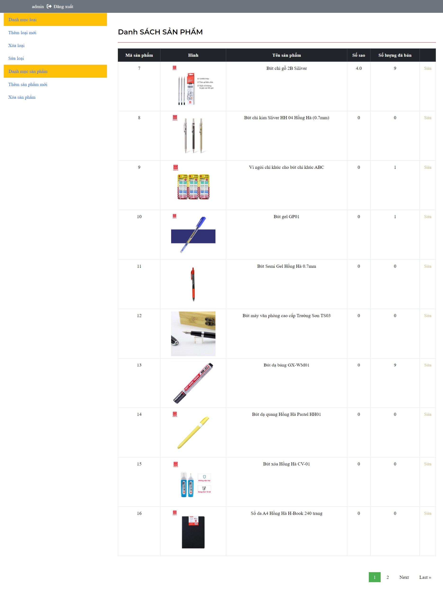
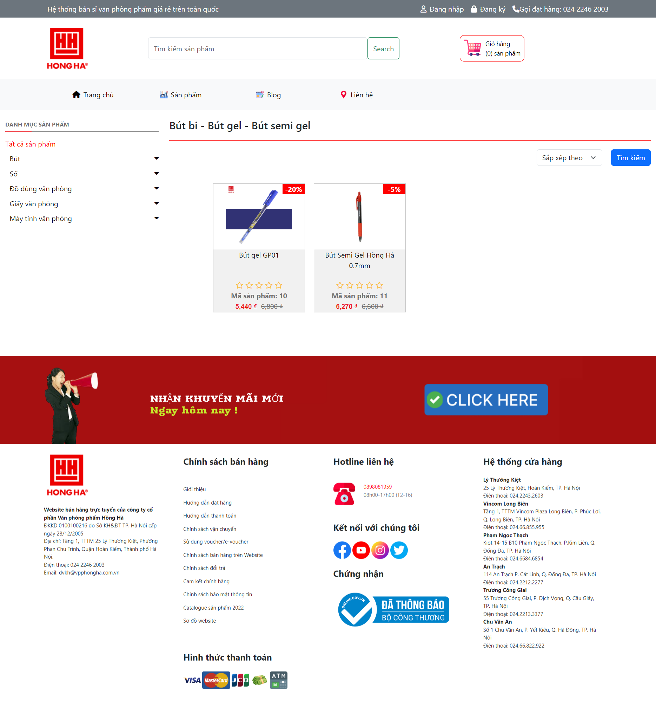
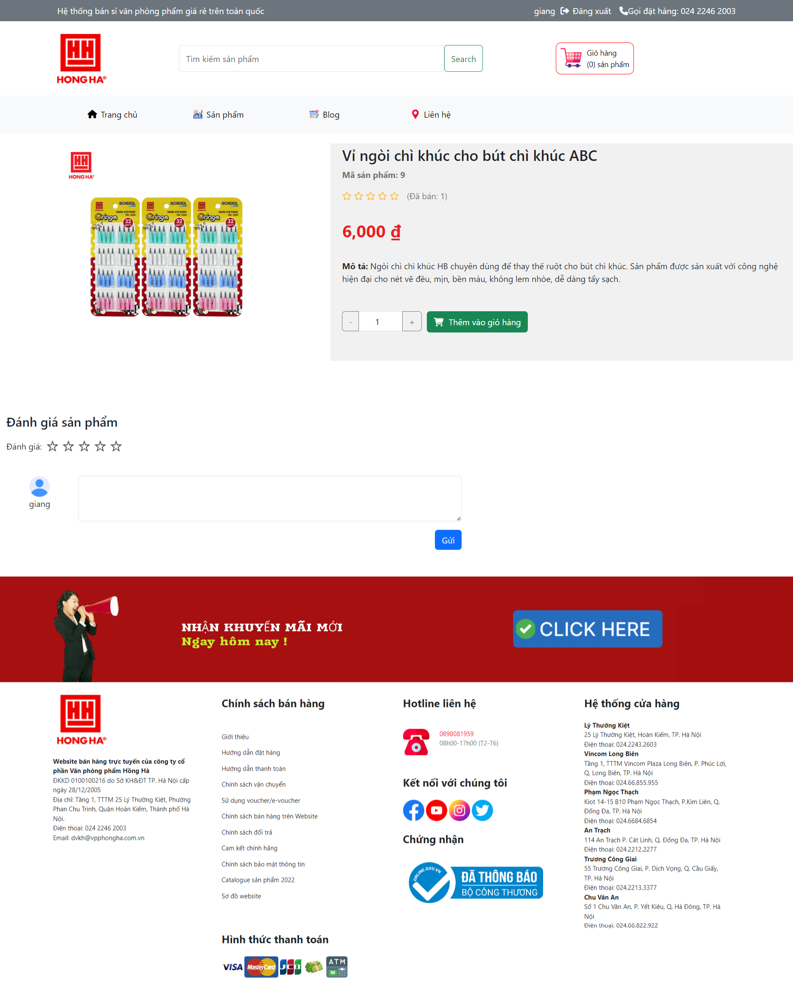

# Website bán sách
## Công nghệ sử dụng
- Front-end: HTML, CSS, Boostrap 5, Javascript
- Back-end: Python
- Database: sqlite3 được tinh hợp sẵn trong Django
- Framework: Django
## Cài đặt
1. **Cài đặt framework Django** https://www.djangoproject.com/download/
2. **Chỉnh sửa file `setting.py` trong thư mục `Office-Supplies/Office-Supplies/setting.py`**
    ```Python
    DATABASES = {
        "default": {
            "ENGINE": "django.db.backends.sqlite3",
            "NAME": BASE_DIR / "db.sqlite3",
        }
    }
    ```
## Tính năng
### Admin
- Sản phẩm (Thêm, sửa, xoá)
- Danh mục (Thêm, sửa, xoá)
### User
- Đăng ký, đăng nhập
- Tìm kiếm sách (theo từ khoá, thể loại)
- Xem thông tin chi tiết sách
- Giỏ hàng: thêm sách, cập nhật số lượng, xoá sách
- Đơn hàng: tạo đơn hàng, xem lịch sử đơn hàng
- Thanh toán
- Đánh giá, bình luận
- Gửi mail
## Admin account
- Username: admin
- Password: srat0123
## Hình ảnh
- Sơ đồ database

- Trang Admin

- Trang chủ

- Danh sách sản phẩm

- Đăng nhập

- Đăng ký

- Giỏ hàng

- Lịch sử đặt hàng

- Thanh toán


- Chi tiết sản phẩm
